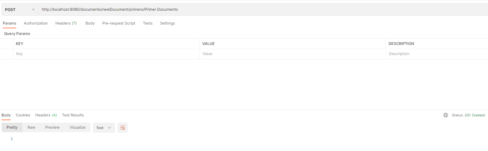

### Escuela Colombiana de Ingeniería

### IETI - Implementar la capa de persistencia con Spring Data MongoDB

### Autor: Diego Leon y Jaime Castro

#### Descripción

En este laboratorio se implementa la capa de persistencia de la aplicación de tareas, utilizando Spring Data MongoDB.

- Se insertan datos en la base de datos de MongoDB.

- Se consultan los datos de la base de datos de MongoDB.

- Se consulta un dato de la base de datos de MongoDB a partir de su nombre.

- Se eliminan los datos de la base de datos de MongoDB.

